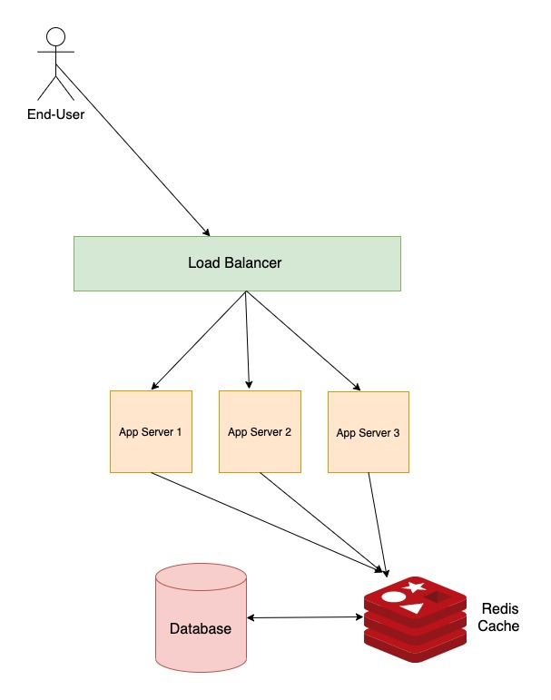

We can scale the application to have better performance by doing the following:

1. Have a Application load balancer infront of the application servers.
2. Implement some caching mechanism for read/write operations.
3. use CDN (Content Delivery Network) to load static data like HTML pages, javascript files,stylesheets,images,and videos.

As Shown in the above figure. Most of the time the performace degradation occurs at the database level where you read or write data. The reads and writes are usually costly operations, you can implement caching using something like Redis.

This makes sure that frequently accessed data is cached and decreases the response time.Additionally we can create read replicas for our databases so that all reads can happen on one database and only writes happen in the master.

For Web users CDN services from cloud providers can give great experirnce as it is superfast. Along with this perform accurate load tests to identify the problem for response time degradation and work on them.

